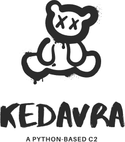

<!-- Improved compatibility of back to top link: See: https://github.com/othneildrew/Best-README-Template/pull/73 -->
<a name="readme-top"></a>
<!--
*** Thanks for checking out the Best-README-Template. If you have a suggestion
*** that would make this better, please fork the repo and create a pull request
*** or simply open an issue with the tag "enhancement".
*** Don't forget to give the project a star!
*** Thanks again! Now go create something AMAZING! :D
-->


<!-- PROJECT SHIELDS -->
<!--
*** I'm using markdown "reference style" links for readability.
*** Reference links are enclosed in brackets [ ] instead of parentheses ( ).
*** See the bottom of this document for the declaration of the reference variables
*** for contributors-url, forks-url, etc. This is an optional, concise syntax you may use.
*** https://www.markdownguide.org/basic-syntax/#reference-style-links
-->
[![MIT License][license-shield]][license-url]
[![LinkedIn][linkedin-shield]][linkedin-url]
<br />
<div align="center">
  <a href="https://github.com/theophane-droid/KadavraC2">
    
  </a>

  <p align="center">
    Use any script, tools, directly executed in memory in your favorite langage !
    <br />
    <a href="#"><strong>Explore the docs »</strong></a>
    <br />
    <br />
    <a href="#">View Demo</a>
    ·
    <a href="#">Report Bug</a>
  </p>
</div>

<!-- TABLE OF CONTENTS -->
<details>
  <summary>Table of Contents</summary>
  <ol>
    <li>
      <a href="#about-the-project">About The Project</a>
      <ul>
        <li><a href="#built-with">Built With</a></li>
      </ul>
    </li>
    <li>
      <a href="#getting-started">Getting Started</a>
      <ul>
        <li><a href="#prerequisites">Prerequisites</a></li>
        <li><a href="#installation">Installation</a></li>
      </ul>
    </li>
    <li><a href="#usage">Usage</a></li>
    <li><a href="#roadmap">Roadmap</a></li>
    <li><a href="#contributing">Contributing</a></li>
    <li><a href="#license">License</a></li>
  </ol>
</details>


## About The Project

KedavraC2 is an innovative Command-and-Control (C2) framework designed to facilitate seamless communication and control between remote endpoints and a central server. Built entirely in Python, KedavraC2 offers a unique approach by executing Python bytecode directly, ensuring high performance and low overhead.

Key Features:

1. Python Bytecode Execution: KedavraC2 eliminates the need for traditional interpreted code execution by directly processing Python bytecode. This approach significantly improves the framework's performance and response times.

2. Cross-Platform Support: With Python being highly portable, KedavraC2 ensures compatibility across various operating systems, including Windows, macOS, and Linux.

3. Modular Architecture: KedavraC2 follows a modular design, allowing easy integration of new functionalities and extensions. This makes it flexible and adaptable to various use cases and environments.

4. Script execution: KedavraC2 can execute any python-based script on compromised client. You can make all you recon and exploitation without dropping any artifact !


## Getting Started

This is an example of how you may give instructions on setting up your project locally.
To get a local copy up and running follow these simple example steps.

### Prerequisites

Please ensure to install python>=3.8 :

[Official python site](https://www.python.org/downloads/)

### Installation

1. Clone the repo

```bash
git clone https://github.com/theophane-droid/KedavraC2
```

2. Install dependancies

```bash
cd KedavraC2
python3 -m pip install -r requirements.txt
```

## Usage

### Create a beacon

```bash
python -m kedavra generate --dest_ip localhost --dest_port 4444 --output aaa.exe --format exe --beacon_type socket
```

> ⚠️ You can not cross-compile beacons, e.g. you must compile windows on windows or linux on linux

### Listen to a beacon

```bash
python -m kedavra listen --listener_type socket --port 4444
```

## Roadmap

- [x] Indicate last contact time on implant
- [x] Automatic compilation using CLI
- [x] README.md
- [x] Command execution
- [x] Script execution
- [ ] Library loading
    - [ ] Load any script size
    - [ ] Compile and send library with dependencies
    - [ ] Use script by using args
- [ ] Cross-protocol network bounce
- [ ] Add builtin tools
- [ ] Protocol support
    - [x] SOCKET
    - [ ] ENCRYPTED SOCKET
    - [ ] HTTPS
    - [ ] DNS

See the [open issues](https://github.com/theophane-droid/KedavraC2/issues) for a full list of proposed features (and known issues).

<p align="right">(<a href="#readme-top">back to top</a>)</p>


<!-- CONTRIBUTING -->
## Contributing

Contributions are what make the open source community such an amazing place to learn, inspire, and create. Any contributions you make are **greatly appreciated**.

If you have a suggestion that would make this better, please fork the repo and create a pull request. You can also simply open an issue with the tag "enhancement".
Don't forget to give the project a star! Thanks again!

1. Fork the Project
2. Create your Feature Branch (`git checkout -b feature/AmazingFeature`)
3. Commit your Changes (`git commit -m 'Add some AmazingFeature'`)
4. Push to the Branch (`git push origin feature/AmazingFeature`)
5. Open a Pull Request

<p align="right">(<a href="#readme-top">back to top</a>)</p>


<!-- LICENSE -->
## License

Distributed under the MIT License. See `LICENSE.txt` for more information.

<p align="right">(<a href="#readme-top">back to top</a>)</p>
